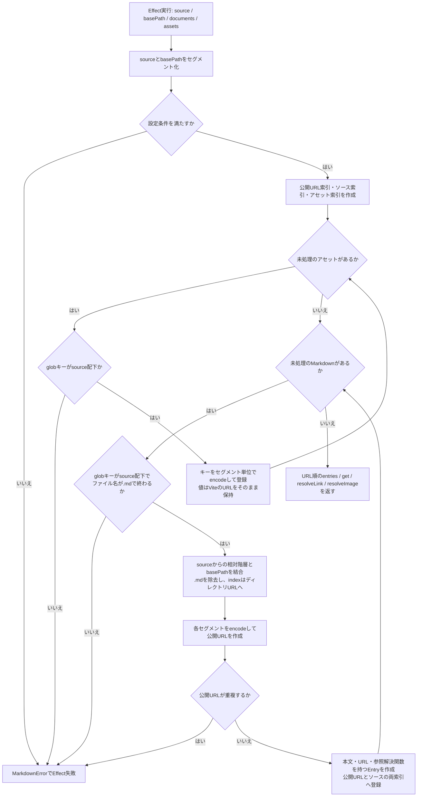
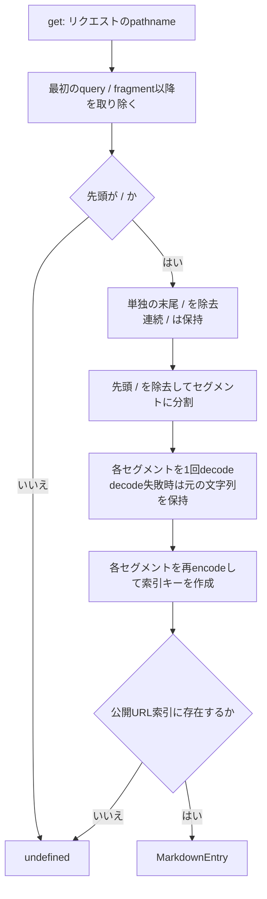
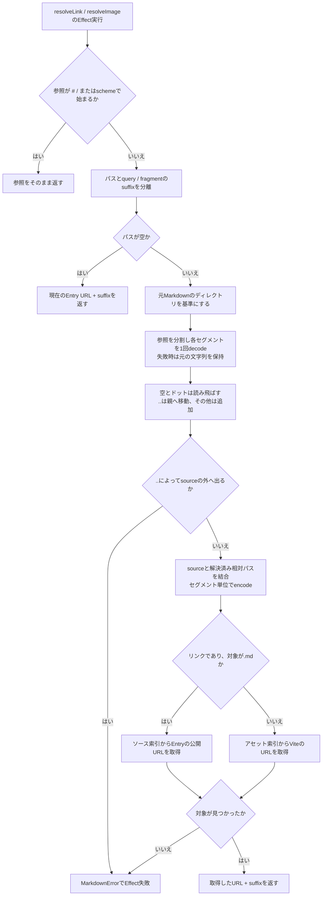

# Markdown integration

## Purpose

This document describes the repository's Markdown integration and its verification boundaries.
For application setup and the public API, see [the package README](../packages/markdown/README.md).
The runnable example is `examples/markdown`.

## Responsibilities

Vite discovers documents with `import.meta.glob` and imports their contents with `?raw`.
Vite also resolves assets with `?url` and owns their development URLs, production emission, and hashing.
The Markdown package consumes those maps rather than implementing a filesystem loader, asset copier, or bundler.

The package maps source files to application URLs while preserving directory hierarchy.
For example, `content/index.md` maps to `/manual` and `content/guide/deep/details.md` maps to `/manual/guide/deep/details`.
Relative document links resolve from their containing source file and retain queries and fragments.
Asset references use URLs supplied by Vite.

`createMarkdownCollection`, `parseMarkdown`, and URL resolvers expose expected failures through `MarkdownError` in Effect's error channel.
Collection entries and `get` remain ordinary values and lookup operations.
A missing document is a lookup miss, allowing the application's catch-all middleware to return 404 before streaming.
Core delegates URL matching and decoding to Effect HTTP and only translates the named catch-all capture.
Collection lookup preserves segment boundaries and decodes each URL segment once, including literal percent filenames.

## collection.ts の処理フロー

対象: [`packages/markdown/src/collection.ts`](../packages/markdown/src/collection.ts)。
このファイルはViteが読み込んだ文字列・アセットURLを索引化します。
Markdownの構文解析とReact描画は別の処理です。

### 1. コレクション生成

`createMarkdownCollection(options)`はEffectを返し、以下の処理はそのEffectを実行したときに行われます。
`documents`は`?raw`の文字列マップ、`assets`は`?url`のURLマップです。

設定確認では、`source`が`./`で始まる空でないディレクトリであること、`basePath`が`/`で始まりquery・fragmentを含まないこと、いずれにも`..`セグメントがないことを確認します。
globキーにも`./`・source配下・`..`なしを求め、`.md`だけのファイル名は受け付けません。
例: `./content/guide/index.md` → `/manual/guide`、`./content/guide/start.md` → `/manual/guide/start`。

### 2. リクエストURLからEntryを検索

`get(pathname)`は同期的なMap検索で、Effectではありません。
見つからない場合は`undefined`を返し、404にする判断は呼び出し側が担当します。

分割してからdecodeするため、セグメント内のencoded slashがディレクトリ境界へ変わることはありません。
ファイル名が文字列として`%20`を含む場合も、URLの`%2520`を二重decodeせず検索します。

### 3. Markdown内のリンク・画像参照を解決

`resolveLink`と`resolveImage`は共通の`resolveLocal`を使うEffectです。
前者はMarkdownファイルをページURLへ解決でき、後者はアセット索引だけを使います。

外部URLやルート相対URLのポリシーはComark・アプリケーション側に委譲します。
アセットの読み込み・変換・出力はViteの担当で、この処理は渡されたURLを検索するだけです。
suffixは文字列として末尾へ追加し、既存URLのqueryを再構成・マージしません。

## Rendering

Parsing retains Comark's standard defaults and adds the mdts plugins for footnotes, math, Mermaid with Tokyo Night, and Shiki.
`parseMarkdown` prepares a Comark document and resolves link/image attributes before rendering.
Applications import Comark's standard `MarkdownDocument` directly and supply their own component mappings.
The package provides no React renderer factory, forced component mappings, or custom Math/Mermaid SSR replacements.

Content and plugins are trusted authored inputs.
This integration is not a sanitizer for untrusted submissions.
Standard Comark document rendering does not automatically register its separate Math/Mermaid components; rich no-JavaScript rendering is tracked in [the roadmap](ROADMAP.md#standard-rendering-and-deferred-rich-ssr).

## Verification

- Repository root: `vp run check` and `vp run test` validate formatting, lint, types, collection errors, URL mapping, parsing, and core contracts.
- `tests/e2e-build`: `vp run test` builds a dedicated fixture and runs browser checks against standalone Wrangler.
- `tests/e2e-dev`: `vp run test` starts Vite development and verifies Markdown edits, additions, and deletion using a minimal fixture.
- Each E2E project has its own fixed Vite and Playwright configuration and only the fixture assets needed for its tests.
- Temporary mutable fixture copies and artifacts stay in ignored package-local `tmp` directories.

Typed metadata, relationships, loaders, and richer SSR support remain separate roadmap items.
